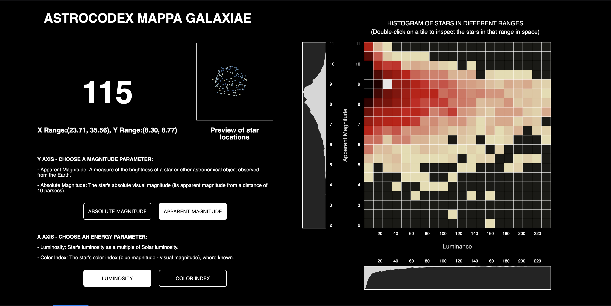
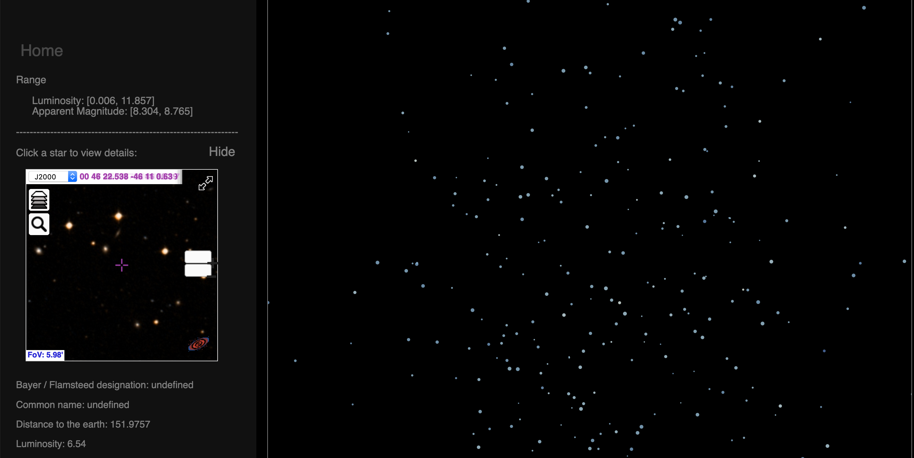
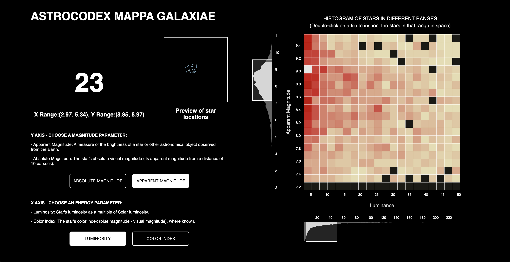

# FP-contextual-visualization
# Astrodex Mappa Galaxiae
An Interactive Online Codex of Stars Based on the HYG Star Catalog Database

project link
      https://kharasso.github.io/codex_galaxiae/project

Website:
https://kharasso.github.io/codex_galaxiae/index.html

Paper:
      https://drive.google.com/file/d/1d77IsUxXU6myvfxHIsEfhZ8vw8DNTKkB/view?usp=sharing

Video:
      https://youtu.be/5qBPBKarNQ8

### Team Members
Ruijun Liu, Huopu Zhang

### Work Process
- Initial Stage

   In the beginning, we mainly looked for proper datasets to work with and looked at past works for inspirations. At this stage, Ruijun found some good references for both works in the same subject and works that have a similar structure. Huopu did research on feasible datasets to work with.

- Prototyping

   In the next period, we worked on initial data exploring and visual prototyping. Huopu was more focused on cleaning the data with Python notebooks and figuring out the algorithms and methodology of rendering the data. Ruijun developed some sketches and snippets of the style and overall layout of our website. We then worked closely together on working out an alpha version of our website.

- Development and Finalizing

   In the last stage, we each took on one view page (as our layout consists of two view pages) as our main focus while discussing with the other, giving critiques on possible improvements on each page. Huopu mostly worked on the first page, while also implemented the communication and transition between the two pages. Ruijun developed most of the features of the second page and included the preview feature and some layout modification on the first page.

### Snapshots

